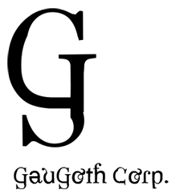

# 

[ [Français](README-fr.md) | [English](README.md) ]

## Qu'est-ce que GauGoth Corp. ?

**GauGoth Corp.** est une organisation créée en 2021 qui développe des jeux vidéos sous le moteur de jeu Unity. Son premier jeu est **Mini Golf 3D: The Pirate flag**.

&nbsp;

Le but de Mini Golf 3D: The Pirate flag et GauGoth Corp. est de ne pas faire d'argent, mais simplement de s'amuser et de partager ses créations. C'est pourquoi toutes les ressources de GauGoth Corp. sont gratuites.

&nbsp;

Pour visiter mon site et découvrir plus de choses sur moi :
[http://gaugoth.corp.free.fr](http://gaugoth.corp.free.fr/).

&nbsp;

## Nouveau ! Galaxie Lointaine

Le site Star Wars ultime créé par les fans, pour les fans.

[https://galaxielointaine.alwaysdata.net](https://galaxielointaine.alwaysdata.net/)

Galaxie Lointaine est un site consacré à Star Wars, divisé en 4 sections dont : les **actualités** de Star Wars, une **encyclopédie**, un **forum** pour parler de Star Wars *avec* les fans de Star Wars, et enfin **un quizz testant vos connaissances de Star Wars** et de son univers en 50 questions !

[https://galaxielointaine.alwaysdata.net/tests-et-quizz/001_quizz-etes-vous-un-vrai-fan-de-star-wars/](https://galaxielointaine.alwaysdata.net/tests-et-quizz/001_quizz-etes-vous-un-vrai-fan-de-star-wars/)

&nbsp;

La création de ce site s'inscrit dans un projet initié le 28 mars 2024 en classe de NSI (Numérique et Sciences de l'Informatique), au lycée.

&nbsp;

Après avoir vu le chapitre sur les formulaires web, notre professeur nous a demandé de nous mettre par groupes de 3 afin de faire une réalisation de formulaires web, accompagné d'un fichier Python analysant les bases de données générées par ces formulaires et permettant de construire des graphiques.

Nous avons choisi, après un petit brain storming, de faire un site Star Wars. Nous l'avons développé à fond, et le voici !

&nbsp;

## Copyrights

*Copyright © 2023-2024 GauGoth Corp. All rights reserved.*

Tous droits réservés. Toute reproduction, duplication ou copie, complète ou partielle, sans l'autorisation de GauGoth Corp. est strictement interdite. 

Si vous avez des questions, des commentaires, des requêtes ou autres, si vous avez remarqué des bugs, contactez-moi à l'adresse [gaugoth.corp@free.fr](mailto:gaugoth.corp@free.fr). 

**En savoir plus à propos des crédits et des copyrights: [En savoir plus](copyrights-fr.md).**
