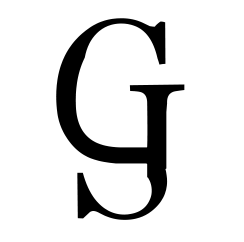

GauGoth Corp. 

# 

[ [English](README.md) | [Français](README-fr.md)  ]

## What is GauGoth Corp. ?

**GauGoth Corp.** is an organization founded in 2021 that develops video games under the Unity game engine. Its first game is **Mini Golf 3D: The Pirate flag**. 

Mini Golf 3D: The Pirate flag and GauGoth Corp. aim is not to make money, but simply to have fun and share its creations. That's why all GauGoth Corp. products are free of charge.

To visit my website and discover more about me :
[GauGoth Corp. website](http://gaugoth.corp.free.fr/).
