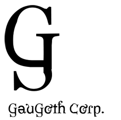
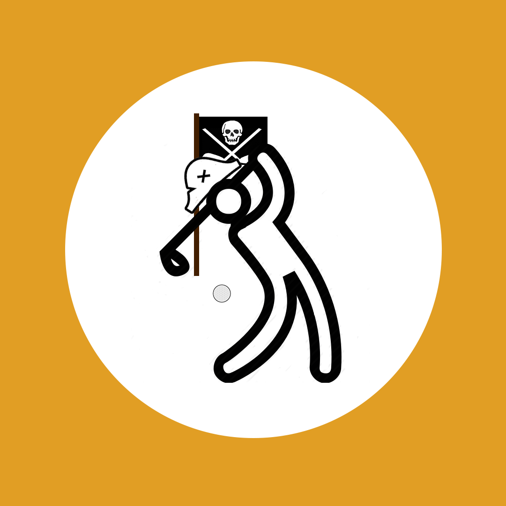
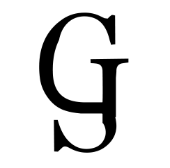
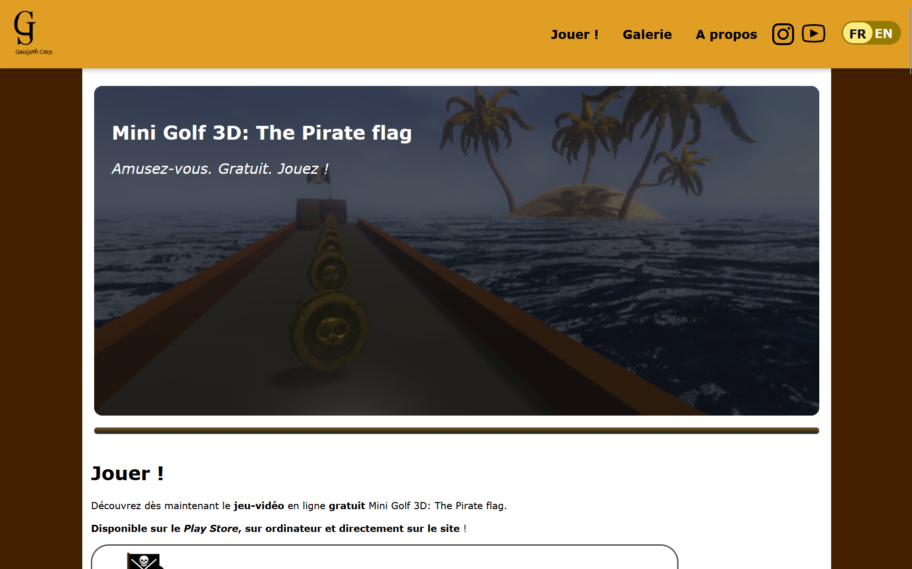
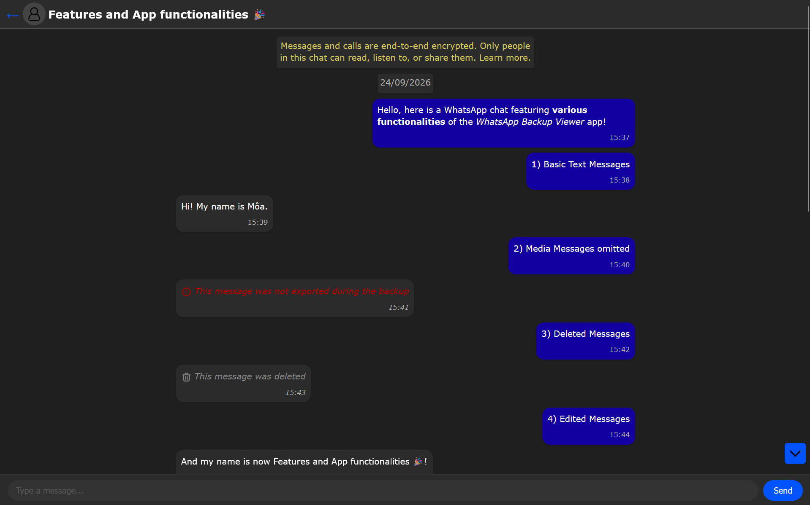
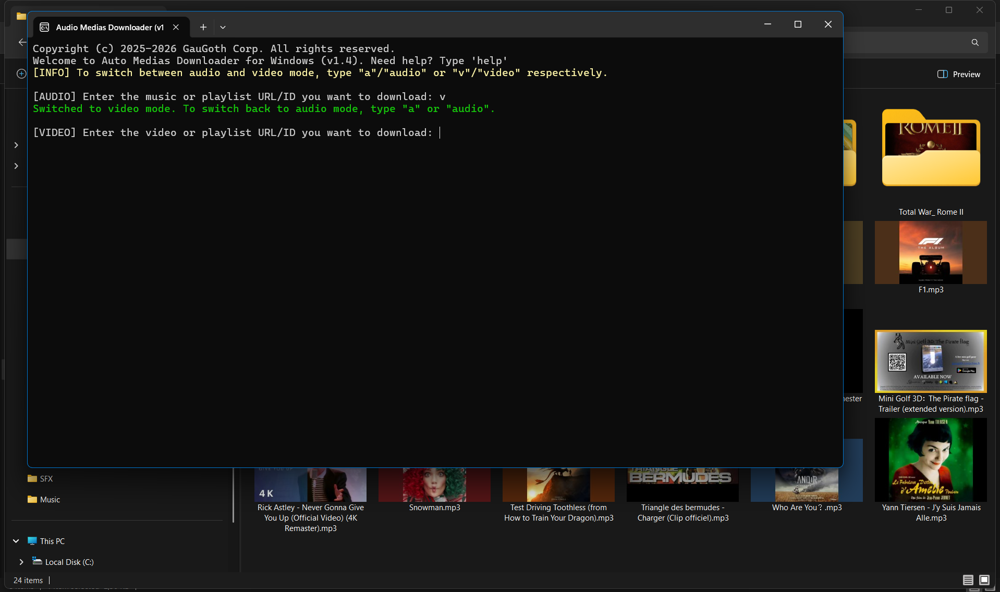
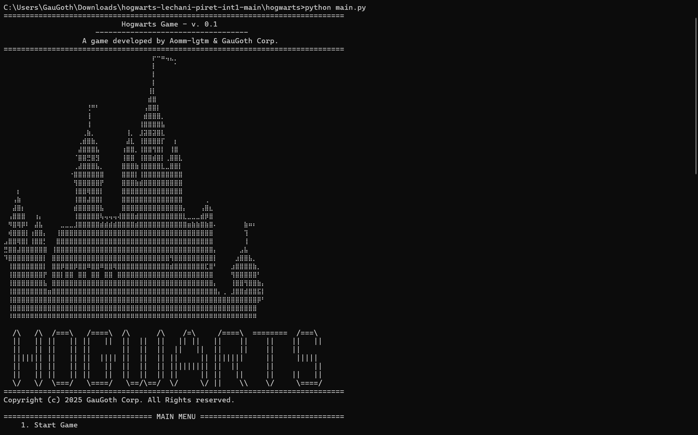

# 

[ [English](README.md) | [Français](README-fr.md)  ]

## ℹ️ About me

**GauGoth Corp.** is a personal project I created in 2021. Initially focused on developing the video game **_Mini Golf 3D: The Pirate flag_**, I later developed many other projects and content, which I share **free of charge** on my website, social media platforms, and GitHub.

## My projects

<!-- Readme stats -->
<!-- 

-->

                          
 

- [**_Mini Golf 3D: The Pirate flag_**](https://gaugoth-corp.pages-perso.free.fr/en/games/) - _Unity_: a 3D mini-golf game in a realistic pirate setting. Available for free on **Windows**, **Mac**, **Linux**, **Android (Google Play)** and **WebGL**. [Play !](https://gaugoth-corp.pages-perso.free.fr/en/games/)

- [**_GauGoth Corp website_**](https://gaugoth-corp.pages-perso.free.fr/en/) - _Web_: the official website of GauGoth Corp., gathering a lot of content related to my work. [Visit !](https://gaugoth-corp.pages-perso.free.fr/en/)

- [**_Galaxie Lointaine_**](https://galaxielointaine.alwaysdata.net/en/) - _Web_: a website about the Star Wars universe, created by fans for fans. It includes news, an encyclopedia, a forum, quizzes, and other surprises. [Discover !](https://galaxielointaine.alwaysdata.net/en/)

- [**_Auto Medias Downloader_**](https://github.com/GauGoth-Corp/Auto-Medias-Downloader) - _Batch Windows_: a software for automatically downloading music and videos. [Download !](https://github.com/GauGoth-Corp/Auto-Medias-Downloader)
- [**_Whatsapp Backup Viewer_**](https://github.com/GauGoth-Corp/WhatsApp-Backup-Viewer) - _Web Application_: a tool for viewing WhatsApp chat backups. [Download !](https://github.com/GauGoth-Corp/WhatsApp-Backup-Viewer)
- [**_Hogwarts Game_**](https://github.com/GauGoth-Corp/hogwarts-lechani-piret-int1) - _Python_: a team project of a text-based role-playing video game based on the Harry Potter universe. [Play !](https://github.com/GauGoth-Corp/hogwarts-lechani-piret-int1)
- [**_The Omicronde Project_**](https://github.com/galaxaris) - _Pygame_: a very complete platformer, developed in a team, on an environmental post-apocalyptic theme. [View the project !](https://github.com/galaxaris)
- [**_Instagram channel_**](https://www.instagram.com/gaugoth_corp/) - _Social Media_: my Instagram channel, where I share content related to my work and projects. [Follow !](https://www.instagram.com/gaugoth_corp/)
- [**_YouTube channel_**](https://www.youtube.com/@GauGoth_Corp/) - _Social Media_: the trailers of _Mini Golf 3D: The Pirate flag_. [Subscribe !](https://www.youtube.com/@GauGoth_Corp/)
- **CMS (Content Management System)** - _Web Application_: an admin project currently in development, to efficiently manage the content of my websites (articles, forum, quizzes, login, statistics, private content, banishment, etc.).
- [**_Nuit du Code_**](https://github.com/Tomate92/Pyxel_NDC_2025) - _Pyxel_: small Python games developed in teams over 8 hours for this programming contest. [2024](https://github.com/Tomate92/Pyxel_Nuit_Du_Code) | [2025](https://github.com/Tomate92/Pyxel_NDC_2025)
- **And many other projects!** _Unity_, _Python_, _C_, _JavaScript_... Do not hesitate to explore my GitHub and my website to discover them! [https://gaugoth-corp.pages-perso.free.fr/en/]()

## Galerie

Some screenshots of my projects:

  
  
  
  
  
  
  
  
  

_1- Mini Golf 3D: The Pirate flag | 2- Mini Golf 3D: The Pirate flag (WebGL) | 3- GauGoth Corp. website | 4- Galaxie Lointaine | 5- Galaxie Lointaine (Quizz) | 6- Whatsapp Backup Viewer | 7- Auto Medias Downloader | 8- Hogwarts Game_

## Copyrights

*Copyright © 2021-2026 GauGoth Corp. All rights reserved.*

All rights reserved. Any reproduction, duplication or copy, complete or partial, without the agreement of the GauGoth Corp. is strictly forbidden.

If you have any questions, comments, requests or other, if you have noticed any bugs, contact me using this form: [Contact me!](https://gaugoth-corp.pages-perso.free.fr/en/credits/contact/).

**Learn more about credits and copyrights: [Learn more](copyrights.md).**
